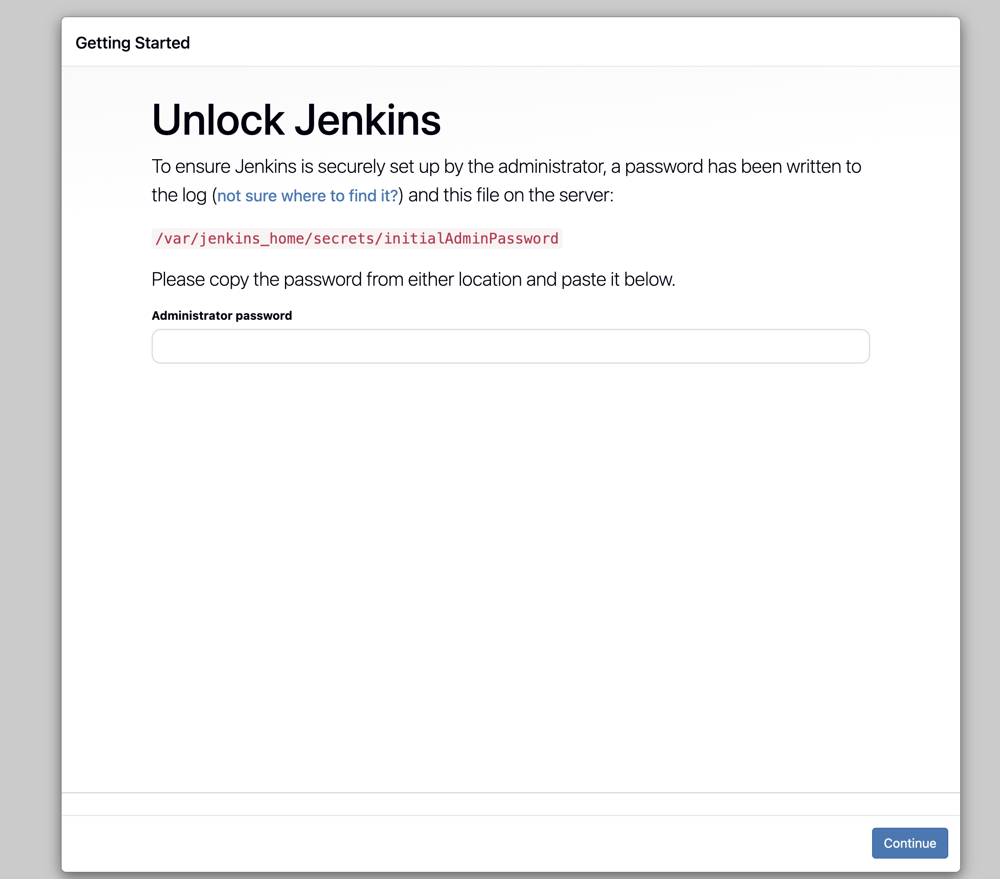
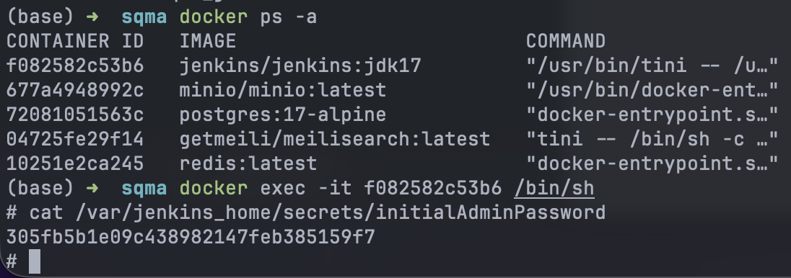
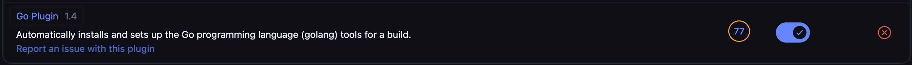
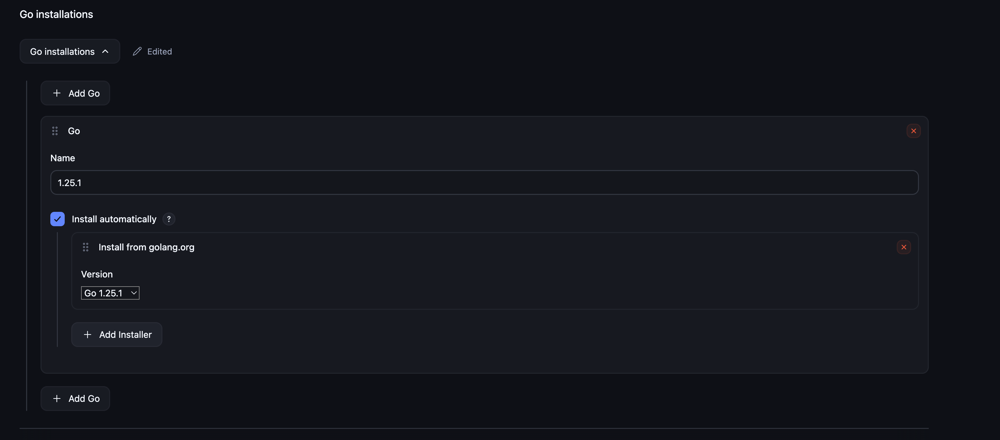
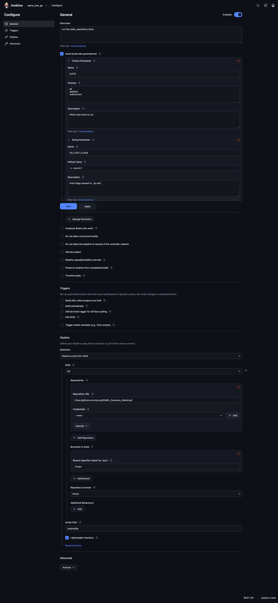
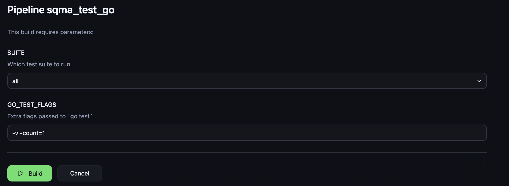
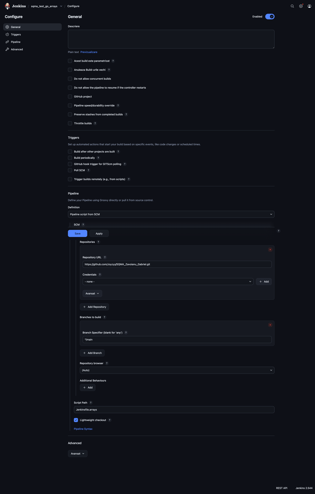

# Software Quality Management & Assurance Homework

This document is the required document with every step and the result of both tasks (Task 1 and Task 2).

To complete either tasks I had to get Jenkins running locally. On the official jenkins app, it didn't have an official distribution for MacOS (only third-party) so instead of installing another executable/brew service I went with the docker installation.

In the codebase, there is the `docker-compose.yml` file that contains the configuration to run Jenkins in a Docker container.

To ensure reproduction, after running `docker-compose up -d`, you will be prompted to _Unlock Jenkins_:


The administrator password can be found inside the docker container at path: `/var/jenkins_home/secrets/initialAdminPassword`:

```bash
docker exec -it <container_id> cat /var/jenkins_home/secrets/initialAdminPassword
```



## Task 1

I'm going to be using Golang for the tests and Jenkins pipeline runner. First step would be to install the Golang plugin from the Jenkins plugin marketplace.

And after installing it, we need to configure the Golang installation in Jenkins global installations:


After that, I created the test cases based off `math_operations.go` implementation. The test cases are the following: `addition_test.go`, `subtraction_test.go`. With the implementation of the test cases, I created a Jenkins pipeline `Jenkinsfile` (in the current repo) that will run the tests using the Golang installation configured before and also fulfilling the "parameterized" requirement:

```yaml
  parameters {
    choice(
      name: 'SUITE',
      choices: ['all', 'addition', 'subtraction'],
      description: 'Which test suite to run'
    )
    string(
      name: 'GO_TEST_FLAGS',
      defaultValue: '-v -count=1',
      description: 'Extra flags passed to `go test`'
    )
  }
```

Here is the Jenkins UI configuration of the created pipeline (some fields are completed automatically when using a Jenkinsfile in the repo):


After running the pipeline with different parameters, here are some results (you can see them better in the ./logs folder):

```sh
Started by user admin

Obtained Jenkinsfile from git https://github.com/Joyzyy/SQMA_Zavoianu_Gabriel.git
[Pipeline] Start of Pipeline
[Pipeline] node
Running on Jenkins
 in /var/jenkins_home/workspace/sqma_test_go
[Pipeline] {
[Pipeline] stage
[Pipeline] { (Declarative: Checkout SCM)
[Pipeline] checkout
Selected Git installation does not exist. Using Default
The recommended git tool is: NONE
No credentials specified
 > git rev-parse --resolve-git-dir /var/jenkins_home/workspace/sqma_test_go/.git # timeout=10
Fetching changes from the remote Git repository
 > git config remote.origin.url https://github.com/Joyzyy/SQMA_Zavoianu_Gabriel.git # timeout=10
Fetching upstream changes from https://github.com/Joyzyy/SQMA_Zavoianu_Gabriel.git
 > git --version # timeout=10
 > git --version # 'git version 2.47.3'
 > git fetch --tags --force --progress -- https://github.com/Joyzyy/SQMA_Zavoianu_Gabriel.git +refs/heads/*:refs/remotes/origin/* # timeout=10
 > git rev-parse refs/remotes/origin/main^{commit} # timeout=10
Checking out Revision 87bb4a7fc6bb3967cedcb7d892ffb114fb979387 (refs/remotes/origin/main)
 > git config core.sparsecheckout # timeout=10
 > git checkout -f 87bb4a7fc6bb3967cedcb7d892ffb114fb979387 # timeout=10
Commit message: "add Jenkinsfile"
 > git rev-list --no-walk 87bb4a7fc6bb3967cedcb7d892ffb114fb979387 # timeout=10
[Pipeline] }
[Pipeline] // stage
[Pipeline] withEnv
[Pipeline] {
[Pipeline] stage
[Pipeline] { (Declarative: Tool Install)
[Pipeline] tool
[Pipeline] envVarsForTool
[Pipeline] }
[Pipeline] // stage
[Pipeline] withEnv
[Pipeline] {
[Pipeline] stage
[Pipeline] { (Checkout)
[Pipeline] tool
[Pipeline] envVarsForTool
[Pipeline] withEnv
[Pipeline] {
[Pipeline] checkout
Selected Git installation does not exist. Using Default
The recommended git tool is: NONE
No credentials specified
 > git rev-parse --resolve-git-dir /var/jenkins_home/workspace/sqma_test_go/.git # timeout=10
Fetching changes from the remote Git repository
 > git config remote.origin.url https://github.com/Joyzyy/SQMA_Zavoianu_Gabriel.git # timeout=10
Fetching upstream changes from https://github.com/Joyzyy/SQMA_Zavoianu_Gabriel.git
 > git --version # timeout=10
 > git --version # 'git version 2.47.3'
 > git fetch --tags --force --progress -- https://github.com/Joyzyy/SQMA_Zavoianu_Gabriel.git +refs/heads/*:refs/remotes/origin/* # timeout=10
 > git rev-parse refs/remotes/origin/main^{commit} # timeout=10
Checking out Revision 87bb4a7fc6bb3967cedcb7d892ffb114fb979387 (refs/remotes/origin/main)
 > git config core.sparsecheckout # timeout=10
 > git checkout -f 87bb4a7fc6bb3967cedcb7d892ffb114fb979387 # timeout=10
Commit message: "add Jenkinsfile"
[Pipeline] }
[Pipeline] // withEnv
[Pipeline] }
[Pipeline] // stage
[Pipeline] stage
[Pipeline] { (Test)
[Pipeline] tool
[Pipeline] envVarsForTool
[Pipeline] withEnv
[Pipeline] {
[Pipeline] dir
Running in /var/jenkins_home/workspace/sqma_test_go/go_tests
[Pipeline] {
[Pipeline] sh
+ go version
go version go1.25.1 linux/arm64
[Pipeline] script
[Pipeline] {
[Pipeline] sh
+ go test -v -count=1 -run ^TestAddition$
=== RUN   TestAddition
=== RUN   TestAddition/positive_numbers
=== RUN   TestAddition/negative_numbers
=== RUN   TestAddition/mixed_numbers
=== RUN   TestAddition/zero_values
=== RUN   TestAddition/with_zero
--- PASS: TestAddition (0.00s)
    --- PASS: TestAddition/positive_numbers (0.00s)
    --- PASS: TestAddition/negative_numbers (0.00s)
    --- PASS: TestAddition/mixed_numbers (0.00s)
    --- PASS: TestAddition/zero_values (0.00s)
    --- PASS: TestAddition/with_zero (0.00s)
PASS
ok  	ism/sqma	0.001s
[Pipeline] }
[Pipeline] // script
[Pipeline] }
[Pipeline] // dir
[Pipeline] }
[Pipeline] // withEnv
[Pipeline] }
[Pipeline] // stage
[Pipeline] }
[Pipeline] // withEnv
[Pipeline] }
[Pipeline] // withEnv
[Pipeline] }
[Pipeline] // node
[Pipeline] End of Pipeline
Finished: SUCCESS
```

Same for subtraction test (truncated):

```sh
[Pipeline] sh
+ go test -v -count=1 -run ^TestSubtraction$
=== RUN   TestSubtraction
=== RUN   TestSubtraction/positive_numbers
=== RUN   TestSubtraction/negative_numbers
=== RUN   TestSubtraction/mixed_numbers
=== RUN   TestSubtraction/zero_values
=== RUN   TestSubtraction/with_zero
--- PASS: TestSubtraction (0.00s)
    --- PASS: TestSubtraction/positive_numbers (0.00s)
    --- PASS: TestSubtraction/negative_numbers (0.00s)
    --- PASS: TestSubtraction/mixed_numbers (0.00s)
    --- PASS: TestSubtraction/zero_values (0.00s)
    --- PASS: TestSubtraction/with_zero (0.00s)
PASS
ok  	ism/sqma	0.001s
```

## Task 2

For Task 2, I created a new test suite based off the `arrays.go` implementation. The test cases are: `arrays_test.go`. The Jenkinsfile associated with the build pipeline for the arrays test suite is `Jenkinsfile.arrays`. Here is the pipeline configuration in the Jenkins UI:


And for fulfilling the parallel pipeline builds for this task I added the `Jenkinsfile.master` file that contains both pipelines running in parallel:

```yaml
pipeline {
    agent any

    stages {
        stage('Run all tests jobs') {
            parallel {
                stage('Math Operations Tests') {
                    steps {
                        build job: 'sqma_test_go'
                    }
                }
                stage('Arrays Tests') {
                    steps {
                        build job: 'sqma_test_go_arrays'
                    }
                }
            }
        }
    }
}
```

Here is the parallelized pipeline configuration in the Jenkins UI:


After running the parallelized pipeline, here is the result:

```sh
Started by user admin

Obtained Jenkinsfile.master from git https://github.com/Joyzyy/SQMA_Zavoianu_Gabriel.git
[Pipeline] Start of Pipeline
[Pipeline] node
Running on Jenkins
 in /var/jenkins_home/workspace/sqma_parallel_builds
[Pipeline] {
[Pipeline] stage
[Pipeline] { (Declarative: Checkout SCM)
[Pipeline] checkout
Selected Git installation does not exist. Using Default
The recommended git tool is: NONE
No credentials specified
Cloning the remote Git repository
Cloning repository https://github.com/Joyzyy/SQMA_Zavoianu_Gabriel.git
 > git init /var/jenkins_home/workspace/sqma_parallel_builds # timeout=10
Fetching upstream changes from https://github.com/Joyzyy/SQMA_Zavoianu_Gabriel.git
 > git --version # timeout=10
 > git --version # 'git version 2.47.3'
 > git fetch --tags --force --progress -- https://github.com/Joyzyy/SQMA_Zavoianu_Gabriel.git +refs/heads/*:refs/remotes/origin/* # timeout=10
 > git config remote.origin.url https://github.com/Joyzyy/SQMA_Zavoianu_Gabriel.git # timeout=10
 > git config --add remote.origin.fetch +refs/heads/*:refs/remotes/origin/* # timeout=10
Avoid second fetch
 > git rev-parse refs/remotes/origin/main^{commit} # timeout=10
Checking out Revision d8acb6a285ee071b81ae3e5caa2a83b19e822653 (refs/remotes/origin/main)
 > git config core.sparsecheckout # timeout=10
 > git checkout -f d8acb6a285ee071b81ae3e5caa2a83b19e822653 # timeout=10
Commit message: "arrays tests and parallel pipeline"
First time build. Skipping changelog.
[Pipeline] }
[Pipeline] // stage
[Pipeline] withEnv
[Pipeline] {
[Pipeline] stage
[Pipeline] { (Run all tests jobs)
[Pipeline] parallel
[Pipeline] { (Branch: Math Operations Tests)
[Pipeline] { (Branch: Arrays Tests)
[Pipeline] stage
[Pipeline] { (Math Operations Tests)
[Pipeline] stage
[Pipeline] { (Arrays Tests)
[Pipeline] build (Building sqma_test_go)
Scheduling project: sqma_test_go

[Pipeline] build (Building sqma_test_go_arrays)
Scheduling project: sqma_test_go_arrays

Starting building: sqma_test_go #4

Starting building: sqma_test_go_arrays #2

Build sqma_test_go_arrays #2
 completed: SUCCESS
[Pipeline] }
[Pipeline] // stage
[Pipeline] }
Build sqma_test_go #4
 completed: SUCCESS
[Pipeline] }
[Pipeline] // stage
[Pipeline] }
[Pipeline] // parallel
[Pipeline] }
[Pipeline] // stage
[Pipeline] }
[Pipeline] // withEnv
[Pipeline] }
[Pipeline] // node
[Pipeline] End of Pipeline
Finished: SUCCESS
```
